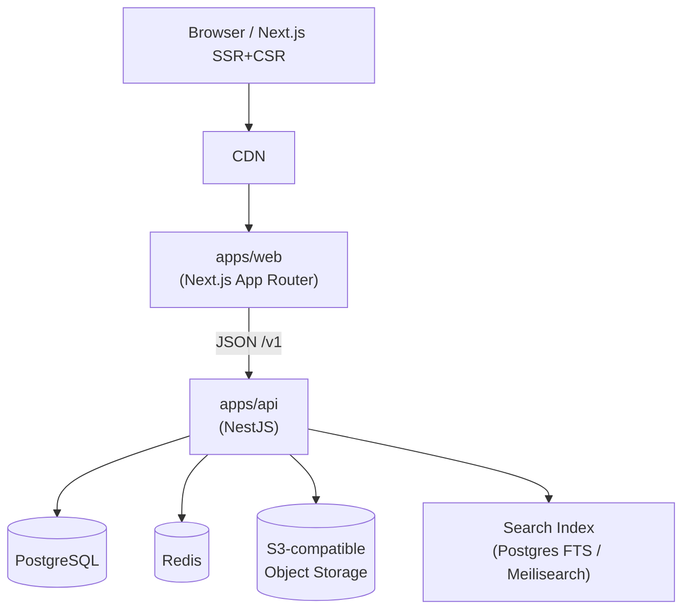

# 总体方案

## 1. 项目性质

《源初之结》（Nodusfall）非官方玩家 Wiki + 攻略 + 论坛。项目为社区内容平台，不是游戏外挂、私服或数据抓取工具。

### 合规边界（必须遵守）

- 只收录公开可获取的资料与玩家自行产出的攻略、讨论。
- 不传播内测保密信息、不破解客户端、不提供任何修改游戏数据的工具。
- 页面脚注标注“非官方粉丝项目”，并保留内容来源与作者署名。
- 用户上传内容遵守社区规范；违规内容提供举报与删除流程。

## 2. 范围

### MVP（M1）

- 用户注册 / 登录 / 资料。
- Wiki 条目：创建、编辑、版本历史、分类、标签、Markdown 渲染。
- 攻略：创建、编辑、标签、评分。
- 论坛：板块、主题、回帖、点赞、收藏。
- 评论：Wiki 与攻略的评论与点赞。
- 搜索：跨 Wiki / 攻略 / 论坛的基础搜索。
- 图片上传与对象存储。

### P2（后续）

- 更完善的审核工作流、编辑者信誉系统。
- 通知、私信、@提及。
- 多语言（i18n）与内容翻译。
- 高级全文检索与同义词。
- 开放 OAuth（Bilibili 等）。

### 非目标

- 实时对战、账号同步、游戏内数据接口。
- 付费会员与虚拟商品（MVP 不实现）。

## 3. 非功能需求

| 类别 | 目标 |
| --- | --- |
| 性能 | API p95 < 300ms；页面 LCP < 2.5s |
| 可用性 | 99.9% |
| 规模 | MVP 支持 1,000 并发用户；架构可扩展到 10,000 |
| 安全 | JWT 访问令牌 + 刷新令牌；RBAC；限流；输入校验 |
| 可维护性 | monorepo、契约先行、CI 自动化检查 |
| 成本 | 优先使用托管服务，MVP 控制在低预算区间 |

## 4. 高层架构

后端采用**模块化单体**而非微服务：MVP 复杂度低、团队小，先以模块边界保持清晰，未来再按需拆分。详见 ADR-002。

## 5. 关键决策摘要

| 编号 | 决策 | 理由 |
| --- | --- | --- |
| ADR-001 | TypeScript monorepo + 共享契约包 | 同一语言、契约可生成类型，降低前后端错配 |
| ADR-002 | 后端模块化单体（NestJS） | MVP 简单、易部署、便于演进 |
| ADR-003 | PostgreSQL + Redis + S3 兼容存储 | 关系型内容 + 缓存 + 文件存储分工明确 |
| ADR-004 | REST + URI 版本 `/v1` + RFC 7807 错误 + 分页 | 契约清晰、可演进 |
| ADR-005 | 双 Agent 分支与目录所有权 | 职能隔离，减少冲突 |

## 6. 里程碑

| 里程碑 | 内容 | 出口标准 |
| --- | --- | --- |
| M0 | 计划、契约、分支权限落地 | `openapi.yaml` 冻结 v1；CODEOWNERS 与分支保护生效 |
| M1 | 后端 MVP | 核心接口可用，OpenAPI 校验通过，集成测试通过 |
| M2 | 前端 MVP | 核心页面可用，视觉验收通过，与 mock 契约对齐 |
| M3 | 前后端联调 | 端到端流程跑通，契约无偏差 |
| M4 | 上线与观测 | 部署、监控、告警、备份就绪 |

## 7. 风险与缓解

| 风险 | 缓解 |
| --- | --- |
| 前后端对字段理解不一致 | 契约单一事实源 + 生成类型 + mock 联调 |
| 两个 Agent 改动冲突 | 目录所有权 + 分支隔离 + 共享契约双审 |
| 游戏内容版权风险 | 仅公开资料、注明来源、非商业化、可删除机制 |
| Wiki 被恶意编辑 | 版本历史 + 回滚 + 审核 + 举报 |
| 非官方项目可能受官方策略影响 | 保持社区内容定位，遵守相关社区规范 |
