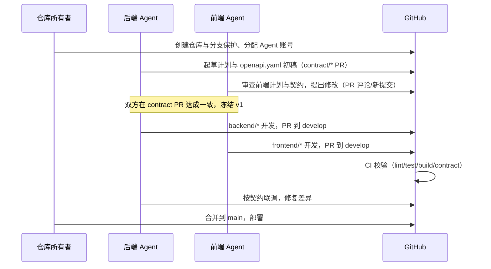

# 协作工作流

## 1. 全流程

## 2. 每个 PR 的要求

- 标题含前缀：`backend:` / `frontend:` / `contract:` / `docs:`。
- 描述说明变更范围与契约影响。
- 通过 CI 全部 status check。
- 前端视觉变更附截图；后端 schema 变更附迁移说明。
- 契约 PR 必须双审。

## 3. 契约冻结后的变更

1. 若字段不够用，先在 Issue 中提出，并附用例。
2. 后端在 `contract/*` 分支修改 `openapi.yaml`。
3. 前端 review；如影响 UI，前端同步更新任务计划与组件。
4. 合并后两端各自拉取最新 `develop` 继续开发。

## 4. Definition of Done

- 代码通过 lint / typecheck / test / build。
- 接口响应与 `openapi.yaml` 完全一致。
- 文档与示例已更新。
- 无跨所有权目录的意外改动。
- PR 已由正确 owner review 并合并到 `develop`。

## 5. 沟通约定

- 技术分歧在 GitHub Issue / PR 评论中留痕，避免只在私聊里达成无法追溯的结论。
- 涉及契约的结论必须回写到 `openapi.yaml` 与对应文档。
- 仓库所有者负责最终仲裁与发布，不参与日常字段决策，除非双方僵持。
